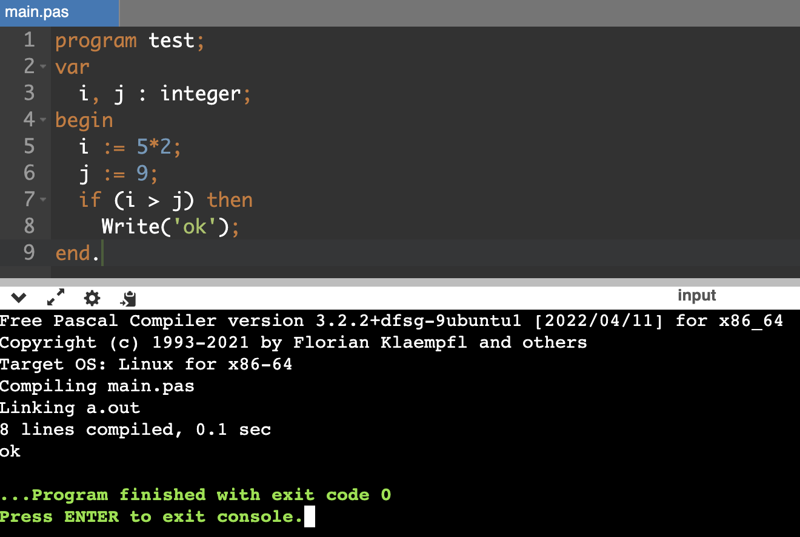

# yacc parser for pascal

1. **lex / yacc version:** flex 2.6.4, bison (GNU Bison) 3.8.2
2. **OS:** Ubuntn 22.04 server installed on VM in MacOS Sonoma
3. **Implementation method:**
   * Creating a makefile to compile a lex file and the final executable file.
        ```makefile
        all: clean y.tab.c lex.yy.c
	        gcc lex.yy.c y.tab.c -lfl -o b096060041.out
        y.tab.c:
            bison -y -d -Wcounterexamples b096060041.y
        lex.yy.c:
            flex b096060041.l
        clean:
            rm -rf b096060041.out lex.yy.c y.tab.c y.tab.h
        ```    
        _*note: You should install 'flex', 'bison' and 'gcc' in your OS before execute ```make```. Here is a simple example install package and execute makefile on ubuntu 22.04._
        ```bash
        $ sudo apt update
        $ sudo apt upgrade
        $ sudo apt install flex bison gcc
        $ make all
        $ make clean
        ```    
4. **How do you sovle the error you may occured which is mentioned in the specification?**
    1. Using undefined variables (or functions), or mismatch between declaration type and assignment type (declared as integer, assigned a string).
        \
        creating a "symbol table" to record the variable's name and its type, to compare whether the type of variable is matched with the value or not.
        ```C
        typedef struct {
            char *name;
            char *type;
        } symbol;
        unsigned int symbolCount = 0;
        symbol symbolTable[MAX_SYMBOLS];
        ```
    2. Structural errors, such as missing parentheses, missing 'if' before 'then', etc.
        \
        defining the correct grammar in the parser, and using `error` to pair the lost token, such as the program structure:
        ```
        prog:
        PROGRAM prog_name SEMI
        VAR
        dec_list SEMI
        BEGIN_
        stmt_list SEMI
        END_ DOT
        | PROGRAM prog_name SEMI
        VAR
        dec_list SEMI
        BEGIN_
        stmt_list SEMI
        END_ error { sprintf(lines_error[lineCount] + strlen(lines_error[lineCount]), "Line %d: missing dot \".\" at the end.\n", lineCount); }
        ;
        ```
        the above parser code show that if the pascal missing the dot at the end after the `end` (`END_` is the term returning from lex.), the `error` will recognize it. Then, it will record the "line" where the error is.
        \
        for another example of if statement:
        ```
        ifstmt:
            IF LP exp RP THEN body %prec LOWER_THAN_ELSE
            | IF LP exp RP THEN body ELSE body
            | IF LP exp RP error body { sprintf(lines_error[lineCount] + strlen(lines_error[lineCount]), "Line %d: at char %d, \"then\" expected but \"%s\" found.\n", lineCount, errorCharCount, errorToken); }
            ;
        ```
        if missing `THEN` after `IF`, it will use the same method (using `error` to recognize it) and print the error code at the error line.
    3. Missing necessary symbols (such as semicolons, periods) or using incorrect symbols.
        \
        the method like mentioned above, using the defining grammar to recognize the missing token and print the error message.
    4. Adding variables of different types together, such as: int + string.
        \
        dealing with adding variables of different types, we use `getSymbolType(const char *name)` function to return the type of variables and use`strcmp(const char *s1, const char *s2)` to compare the type is. If `strcmp` return `0` means they are same data type, which could be operated; on the contrart, will not.
        ```
        simpexp:
            term { $$ = $1; }
            | simpexp PLUS term{
                char *type1 = getSymbolType($1), *type2 = getSymbolType($3);
                if (type1 && type2 && strcmp(type1, type2) != 0)
                    sprintf(lines_error[lineCount] + strlen(lines_error[lineCount]), "Line %d: type mismatch: cannot add \"%s\" (%s) to \"%s\" (%s)\n", lineCount, $1, type1, $3, type2);
                $$ = $1 ? strdup($1) : strdup($3); // same data type
            }
            | simpexp MINUS term{
                char *type1 = getSymbolType($1), *type2 = getSymbolType($3);
                if (type1 && type2 && strcmp(type1, type2) != 0)
                    sprintf(lines_error[lineCount] + strlen(lines_error[lineCount]), "Line %d: type mismatch: cannot substract \"%s\" (%s) to \"%s\" (%s)\n", lineCount, $1, type1, $3, type2);
                $$ = $1 ? strdup($1) : strdup($3); // same data type
            }
            | PLUS term
            | MINUS term
            ;

        term:
            factor { $$ = $1; }
            | term MUL factor
            | term DIV factor
            | term MOD factor
            ;

        factor:
            varid { $$ = $1; }
            | INT { $$ = $1; }
            | REAL { $$ = $1; }
            | STR { $$ = $1; }
            | LP simpexp RP
            ;
        ```
5. **What problems did you encounter when working on the assignment?**
    1. How to print each line:
        There are two ways to print each line of the source code: one in lex and the other one in yacc. 
        I chose to handle all the code separation based on newline characters in lex, share the entire string array with the yacc file (as an external variable), and then in yacc, only record error output. 
        Specifically, print out the lines by their number, prioritize printing if there is an error message, otherwise print the original content of the line.
    2. Class determination issue:
        Since native C language does not support hash maps (which means we must be manually implemented), I constructed a symbol table using `struct` consisting of an ID and its category as pairs, stored all pairs in an array. 
        When determining if a definition exists, perform a linear search based on the ID (string), and use the same linear search for pairs when checking if categories are the same. This allows access to the category corresponding to the ID
6. **The result of test:**
    * correct.pas
        ```=
        program test;
        var 
        (* one line comment *)
          i, j: integer;
          ans: array[0 .. 81] of integer;
        begin
            i := -1+3;
            j := +7*8;
            ans[0] := 7;
            (* 
            multiple lines comments
            do not show comments
            *)
            for i:=1 to 9 do 
            begin
                for j:=1 to i do
                    ans[i*9+j] := i*j;
            end;

            for i:=1 to 9 do 
            begin
                for j:=1 to i do
                    if ( ans[i*9+j] mod 2 = 0) then
                        write(i, '*', j, '=', ans[i*9+j], ' ');
                writeln;
            end;
        end.
        ```
        ```
        yen@yenubuntu:~/yacc$ ./b096060041.out < testfile_lab2_2022/yacc_testfile/testfile/correct.pas 
        Line 1: program test;
        Line 2: var 
        Line 4:   i, j: integer;
        Line 5:   ans: array[0 .. 81] of integer;
        Line 6: begin
        Line 7:     i := -1+3;
        Line 8:     j := +7*8;
        Line 9:     ans[0] := 7;
        Line 14:     for i:=1 to 9 do 
        Line 15:     begin
        Line 16:         for j:=1 to i do
        Line 17:             ans[i*9+j] := i*j;
        Line 18:     end;
        Line 19:     
        Line 20:     for i:=1 to 9 do 
        Line 21:     begin
        Line 22:         for j:=1 to i do
        Line 23:             if ( ans[i*9+j] mod 2 = 0) then
        Line 24:                 write(i, '*', j, '=', ans[i*9+j], ' ');
        Line 25:         writeln;
        Line 26:     end;
        Line 27: end.
        ```
    * error1.pas
        ```=
        program test;
        var
          i : integer;
        begin
          i = 3;
          j = 4;
          if (i > j) then
            Write('ok');
        end.
        ```
        ```
        yen@yenubuntu:~/yacc$ ./b096060041.out < testfile_lab2_2022/yacc_testfile/testfile/error1.pas 
        Line 1: program test;
        Line 2: var
        Line 3:   i : integer;
        Line 4: begin
        Line 5: at char 5, ":=" expected but "=" found.
        Line 6: "j" is an undeclared variable
        Line 6: at char 5, ":=" expected but "=" found.
        Line 7: "j" is an undeclared variable
        Line 8:     Write('ok');
        Line 9: end.
        ```
    * error2.pas
        ```=
        program test;
        var
          i, j : integer;
        begin
          i := 5*2;
          j := 9;
          if (i > j) then
            Write('ok');
        end.
        ```
        > actually, there does not have an error.
        > 
        > 
        ```
        yen@yenubuntu:~/yacc$ ./b096060041.out < testfile_lab2_2022/yacc_testfile/testfile/error2.pas 
        Line 1: program test;
        Line 2: var
        Line 3:   i, j : integer;
        Line 4: begin
        Line 5:   i := 5*2;
        Line 6:   j := 9;
        Line 7:   if (i > j) then
        Line 8:     Write('ok');
        Line 9: end.
        ```
    * error3.pas
        ```=
        program test;
        var
          i, j := integer;
        begin
          i := 5;
        end
        ```
        ```
        yen@yenubuntu:~/yacc$ ./b096060041.out < testfile_lab2_2022/yacc_testfile/testfile/error3.pas 
        Line 1: program test;
        Line 2: var
        Line 3: at char 8, ":" expected but ":=" found.
        Line 4: begin
        Line 5: "i" is an undeclared variable
        Line 6: missing dot "." at the end.
        ```
    * error4.pas
        ```=
        program test;
        var
          i, j : integer;
          c : string;
        begin
          i := 5;
          c := 'aa';
          i = i+c;
        end.
        ```
        ```
        yen@yenubuntu:~/yacc$ ./b096060041.out < testfile_lab2_2022/yacc_testfile/testfile/error4.pas 
        Line 1: program test;
        Line 2: var
        Line 3:   i, j : integer;
        Line 4:   c : string;
        Line 5: begin
        Line 6:   i := 5;
        Line 7:   c := 'aa';
        Line 8: type mismatch: cannot add "i" (integer) to "c" (string)
        Line 8: at char 5, ":=" expected but "=" found.
        Line 9: end.
        ```


_*note: this assignment only follow the rule of the course in NSYSU, Compiler Spring 24'. That is, the parser may not cover all the grammar of the PASCAL, which only could be a reference for learning coding the lex and the yacc. If you want to compile a real and applicable parser for PASCAL, please refer the documents throught the internet and the [website](https://www.freepascal.org/) of PASCAL or the [onlineGDB compiler of pascal](https://www.onlinegdb.com/online_pascal_compiler)._
   